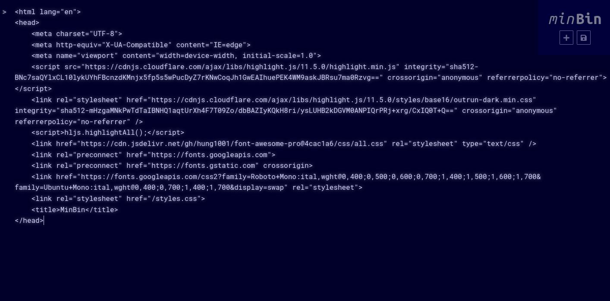

	<h1>MinBin</h1>
	
A (work-in-progress) minimal &amp; self-hostable alternative to pastebin, intended for code

	
<a href="https://bin.kio.dev/" target="_blank">&gt;&nbsp;bin.kio.dev</a>

<h3>Usage</h3>

Running in dev mode: `npm run dev` 

Running for production: `npm run build` then `npm run start` 

<h3>Interface<h3>

<h3>To-do</h3>

Check out <a href="TODO.md">TODO.md</a> for a list of planned & in-progress features.
